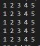
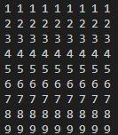

# Let's dig deeper into the C patterns

- nested loop
- i loop and j loop

    
<h3>Pattern 1</h3>

    
9 x 9 (1 - 9)

    
    <h4>Steps:</h4>
    <ul>
    <li>Step 1: Print 1 - 9 with a for loop</li>
    <li>Step 2: repeat it for 9 times</li>
    </ul>

    
<h3>Pattern 2</h3>

    
9 x 9 (1, 9 times then 2, 9 times and so on)

    
    <h4>Steps:</h4>
    <ul>
    <li>Step 1: Print 1, 9 times with a for loop (this time print outer loop (i))</li>
    <li>Step 2: repeat it for 9 times</li>
    </ul>

