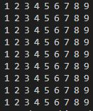

# Let's dig deeper into the C patterns

- nested loop
- i loop and j loop

    
Pattern 1

    
5 x 5 (1 - 5)

    
    <h4>Steps:</h4>
    <ul>
    <li>Step 1: Print 1 - 5 with a for loop</li>
    <li>Step 2: repeat it for 5 times</li>
    </ul>

