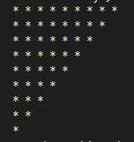

# Let's dig deeper into the C patterns

- nested loop
- i loop and j loop
- if start value is common then j = common value; unless j = i; j>= / J<=; j++ / j--
- if the last value is common then j>= / J<= "that common value"
- i represents row and j represents column

    
<h3>Pattern 1</h3>

    <h4>9 x 9 (1 - 9)</h4>
    
    <h4>Steps:</h4>
    <ul>
    <li>Step 1: Print 1 - 9 with a for loop</li>
    <li>Step 2: repeat it for 9 times</li>
    </ul>

    
<h3>Pattern 2</h3>

    <h4>9 x 9 (1, 9 times then 2, 9 times and so on)</h4>
    
    <h4>Steps:</h4>
    <ul>
    <li>Step 1: Print 1, 9 times with a for loop (this time print outer loop (i))</li>
    <li>Step 2: repeat it for 9 times</li>
    </ul>

    
<h3>Pattern 3</h3>

    <h4>9 x 9 (filled with *)</h4>
    
    <h4>Steps:</h4>
    <ul>
    <li>Step 1: Print 9 * with a for loop</li>
    <li>Step 2: repeat it for 9 times</li>
    </ul>

    
<h3>Pattern 4</h3>

    <h4>9 x 9 ( A - I)</h4>
    
    <h4>Steps:</h4>
    <ul>
    <li>Step 1: Print A - I with a for loop</li>
    <li>Step 2: repeat it for 9 times</li>
    <li>Step 3: solved it using array of Alphabets as well as ASCII codes</li>
    </ul>

    
<h3>Pattern 5</h3>

    <h4>9 x 9 (9 - 1)</h4>
    
    <h4>Steps:</h4>
    <ul>
    <li>Step 1: Print 9 - 1 with a for loop</li>
    <li>Step 2: repeat it for 9 times</li>
    </ul>

    
<h3>Pattern 6</h3>

    <h4>9 x 9 (9, 9 times then 8, 9 times and so on)</h4>
    
    <h4>Steps:</h4>
    <ul>
    <li>Step 1: Print 9, 9 times with a for loop</li>
    <li>Step 2: repeat it for 9 times</li>
    </ul>

    
<h3>Pattern 7</h3>

    <h4>Right angle triangle (1 - 9)</h4>
    
    <h4>Steps:</h4>
    <ul>
    <li>Step 1: Print 1 - 9 with a for loop</li>
    <li>Step 2: assign j <= i and continue the loop</li>
    </ul>

<h3>Pattern 8</h3>

    <h4>Right angle triangle (1, 1 time, 2, 2 time and so on)</h4>
    
    <h4>Steps:</h4>
    <ul>
    <li>Step 1: Print 1 - 9 with a for loop</li>
    <li>Step 2: assign j <= i and continue the loop</li>
    <li>Step 3: print i instead of j</li>
    </ul>

<h3>Pattern 9</h3>

    <h4>Right angle triangle (All filled with *)</h4>
    
    <h4>Steps:</h4>
    <ul>
    <li>Step 1: Print 1 - 9 with a for loop</li>
    <li>Step 2: assign j <= i and continue the loop</li>
    <li>Step 3: print * instead of i/j</li>
    </ul>

<h3>Pattern 10</h3>

    <h4>Right angle triangle (All filled with Alphabets (A - I))</h4>
    
    <h4>Steps:</h4>
    <ul>
    <li>Step 1: Print A - I with a for loop</li>
    <li>Step 2: assign j <= i and continue the loop</li>
    <li>Step 3: print j + 64 (ASCII) instead of j</li>
    <li>Step 4: change "%d" = > "%c"</li>
    </ul>

<h3>Pattern 11</h3>

    <h4>Right angle triangle (All filled with Alphabets (A - I, A, ALl B and so on))</h4>
    
    <h4>Steps:</h4>
    <ul>
    <li>Step 1: Print A - I with a for loop</li>
    <li>Step 2: assign j <= i and continue the loop</li>
    <li>Step 3: print i + 64 (ASCII) instead of j</li>
    <li>Step 4: change "%d" = > "%c"</li>
    </ul>

<h3>Pattern 12</h3>

    <h4>Right angle triangle (9 - 1 backward)</h4>
    
    <h4>Steps:</h4>
    <ul>
    <li>Step 1: Print 9 - 1 with a for loop</li>
    <li>Step 2: assign j <= i and continue the loop</li>
    </ul>

<h3>Pattern 13</h3>

    <h4>Right angle triangle (9 - 1 backward)</h4>
    
    <h4>Steps:</h4>
    <ul>
    <li>Step 1: Print 9 - 1 with a for loop</li>
    <li>Step 2: assign j <= i and continue the loop</li>
    <li>Step 3: print i instead of j</li>
    </ul>

<h3>Pattern 14</h3>

    <h4>Reversed Right angle triangle (9 - 1 backward)</h4>
    
    <h4>Steps:</h4>
    <ul>
    <li>Step 1: Print 9 - 1 with a for loop i incremental and j decremantal</li>
    <li>Step 2: assign j <= i and continue the loop</li>
    </ul>

<h3>Pattern 15</h3>

    <h4>Right angle triangle (1 21 321 4321 ....)</h4>
    
    <h4>Steps:</h4>
    <ul>
    <li>Step 1: first items varies so j =i</li>
    <li>Step 2: Row decremental so j will be decramental</li>
    <li>Step 3: Column incremental so i will be incremental</li>
    </ul>

<h3>Pattern 16</h3>

    <h4>Right angle triangle (123456789 12345678 123467 ......)</h4>
    
    <h4>Steps:</h4>
    <ul>
    <li>Step 1: first item doesn't varie so j =1</li>
    <li>Step 2: Row incremental so j will be incramental</li>
    <li>Step 3: Column decremental so i will be decremental</li>
    </ul>

<h3>Pattern 17</h3>

    <h4>Right angle triangle (123456789 12345678 123467 ......)</h4>
    
    <h4>Steps:</h4>
    <ul>
    <li>Step 1: first item varies so j = i</li>
    <li>Step 2: Row incremental so j will be incramental</li>
    <li>Step 3: Column incremental so i will be incremental</li>
    </ul>

<h3>Pattern 18</h3>

    <h4>Right angle triangle (123456789 12345678 123467 ......)</h4>
    
    <h4>Steps:</h4>
    <ul>
    <li>Step 1: first item doesn't varie so j =1</li>
    <li>Step 2: Row incremental so j will be incramental</li>
    <li>Step 3: Column decremental so i will be decremental</li>
    </ul>

<h3>Pattern 19</h3>

    <h4>Right angle triangle (123456789 12345678 123467 ......)</h4>
    
    <h4>Steps:</h4>
    <ul>
    <li>Step 1: first item doesn't varie so j =1</li>
    <li>Step 2: Row incremental so j will be incramental</li>
    <li>Step 3: Column decremental so i will be decremental</li>
    </ul>

<h3>Pattern 20</h3>

    <h4>Right angle triangle (123456789 12345678 123467 ......)</h4>
    
    <h4>Steps:</h4>
    <ul>
    <li>Step 1: first item doesn't varie so j =1</li>
    <li>Step 2: Row incremental so j will be incramental</li>
    <li>Step 3: Column decremental so i will be decremental</li>
    </ul>

<h3>Pattern 21</h3>

    <h4>Right angle triangle (All filled with *)</h4>
    
    <h4>Steps:</h4>
    <ul>
    <li>Step 1: first item doesn't varie so j =1</li>
    <li>Step 2: Row incremental so j will be incramental</li>
    <li>Step 3: Column decremental so i will be decremental</li>
    </ul>

<h3>Pattern 22</h3>

    <h4>Right angle triangle (All filled with *)</h4>
    
    <h4>Steps:</h4>
    <ul>
    <li>Step 1: first item doesn't varie so j =1</li>
    <li>Step 2: Row incremental so j will be incramental</li>
    <li>Step 3: Column decremental so i will be decremental</li>
    </ul>

<h3>Pattern 23</h3>

    <h4> * Square (Only outline by *)</h4>
    
    <h4>Steps:</h4>
    <ul>
    <li>Step 1: make a square filled with *</li>
    <li>Step 2: i represents row and j represents column</li>
    <li>Step 3: if(i == 1 || i == 9 || j == 1 || j ==9) printf("*")</li>
    <li>Step 4: else printf(" ")</li>
    <li>Step 5: if you put 1 space with printf("* "), you need to put 2 spaces with printf("  ") (space = * space + 1)</li>
    </ul>

<h3>Pattern 24</h3>

    <h4> * Triangle (Only outline by *)</h4>
    
    <h4>Steps:</h4>
    <ul>
    <li>Step 1: make a triangle filled with *</li>
    <li>Step 2: i represents row and j represents column</li>
    <li>Step 3: if(j == 1 || i == 9 || j == i) printf("*")</li>
    <li>Step 4: else printf(" ")</li>
    <li>Step 5: if you put 1 space with printf("* "), you need to put 2 spaces with printf("  ") (space = * space + 1)</li>
    </ul>

<h3>Pattern 25</h3>

    <h4> Triangle (filled with 1,0 repetadly)</h4>
    
    
    <h4>Steps:</h4>
    <ul>
    <li>Step 1: make a triangle filled with (1 12 123 1234.....) pattern</li>
    <li>Step 2: instead of printing j directly into to printf("%d ",j), print printf("%d ", j % 2)</li>
    </ul>

<h3>Pattern 26</h3>

    <h4> Triangle (filled with 1,0 serially)</h4>
    
    
    <h4>Steps:</h4>
    <ul>
    <li>Step 1: make a triangle filled with (1 23 456 78910.....) pattern</li>
    <li>Step 2: instead of printing j declare a variable int k =1 and print k++</li>
    <li>Step 3: instead of printing j directly into to printf("%d ",j), print printf("%d ", k++ % 2)</li>
    </ul>

<h3>Pattern 27</h3>

    <h4> * Triangle (Only outline by *)</h4>
    
    
    
    <h4>Steps:</h4>
    <ul>
    <li>Step 1: make a triangle filled with (1 12 123 1234.....) pattern</li>
    <li>Step 2: Remove the space from printf("%d",j)</li>
    <li>Step 3: Add another k loop inside i loop in a decremental manner to put the spaces</li>
    <li>Step 4: While decremental spaces k = end value and upto i</li>
    </ul>

