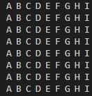

# Let's dig deeper into the C patterns

- nested loop
- i loop and j loop

    
<h3>Pattern 1</h3>

    
9 x 9 (1 - 9)

    
    <h4>Steps:</h4>
    <ul>
    <li>Step 1: Print 1 - 9 with a for loop</li>
    <li>Step 2: repeat it for 9 times</li>
    </ul>

    
<h3>Pattern 2</h3>

    
9 x 9 (1, 9 times then 2, 9 times and so on)

    
    <h4>Steps:</h4>
    <ul>
    <li>Step 1: Print 1, 9 times with a for loop (this time print outer loop (i))</li>
    <li>Step 2: repeat it for 9 times</li>
    </ul>

    
<h3>Pattern 3</h3>

    
9 x 9 (filled with *)

    
    <h4>Steps:</h4>
    <ul>
    <li>Step 1: Print 9 * with a for loop</li>
    <li>Step 2: repeat it for 9 times</li>
    </ul>

    
<h3>Pattern 4</h3>

    
9 x 9 ( A - I)

    
    <h4>Steps:</h4>
    <ul>
    <li>Step 1: Print A - I with a for loop</li>
    <li>Step 2: repeat it for 9 times</li>
    <li>Step 3: solved it using array of Alphabets as well as ASCII codes</li>
    </ul>

    
<h3>Pattern 5</h3>

    
9 x 9 (9 - 1)

    
    <h4>Steps:</h4>
    <ul>
    <li>Step 1: Print 9 - 1 with a for loop</li>
    <li>Step 2: repeat it for 9 times</li>
    </ul>

    
<h3>Pattern 6</h3>

    
9 x 9 (9, 9 times then 8, 9 times and so on)

    
    <h4>Steps:</h4>
    <ul>
    <li>Step 1: Print 9, 9 times with a for loop</li>
    <li>Step 2: repeat it for 9 times</li>
    </ul>

    
<h3>Pattern 7</h3>

    
Right angle triangle (1 - 9)

    
    <h4>Steps:</h4>
    <ul>
    <li>Step 1: Print 1 - 9 with a for loop</li>
    <li>Step 2: assign j <= i and continue the loop</li>
    </ul>

<h3>Pattern 8</h3>

    
Right angle triangle (1, 1 time, 2, 2 time and so on)

    
    <h4>Steps:</h4>
    <ul>
    <li>Step 1: Print 1 - 9 with a for loop</li>
    <li>Step 2: assign j <= i and continue the loop</li>
    <li>Step 3: print i instead of j</li>
    </ul>

<h3>Pattern 9</h3>

    
Right angle triangle (All filled with *)

    
    <h4>Steps:</h4>
    <ul>
    <li>Step 1: Print 1 - 9 with a for loop</li>
    <li>Step 2: assign j <= i and continue the loop</li>
    <li>Step 3: print * instead of i/j</li>
    </ul>

<h3>Pattern 10</h3>

    
Right angle triangle (All filled with Alphabets (A - I))

    
    <h4>Steps:</h4>
    <ul>
    <li>Step 1: Print A - I with a for loop</li>
    <li>Step 2: assign j <= i and continue the loop</li>
    <li>Step 3: print j + 64 (ASCII) instead of j</li>
    <li>Step 4: change "%d" = > "%c"</li>
    </ul>

<h3>Pattern 11</h3>

    
Right angle triangle (All filled with Alphabets (A - I, A, ALl B and so on))

    
    <h4>Steps:</h4>
    <ul>
    <li>Step 1: Print A - I with a for loop</li>
    <li>Step 2: assign j <= i and continue the loop</li>
    <li>Step 3: print i + 64 (ASCII) instead of j</li>
    <li>Step 4: change "%d" = > "%c"</li>
    </ul>

<h3>Pattern 12</h3>

    
Right angle triangle (9 - 1 backward)

    
    <h4>Steps:</h4>
    <ul>
    <li>Step 1: Print 9 - 1 with a for loop</li>
    <li>Step 2: assign j <= i and continue the loop</li>
    </ul>

<h3>Pattern 1</h3>

    
Right angle triangle (9 - 1 backward)

    
    <h4>Steps:</h4>
    <ul>
    <li>Step 1: Print 9 - 1 with a for loop</li>
    <li>Step 2: assign j <= i and continue the loop</li>
    <li>Step 3: print i instead of j</li>
    </ul>

